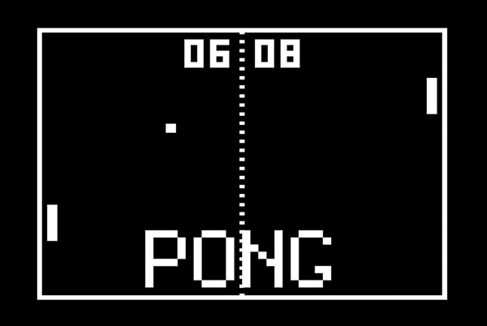

# 🎮 Pong Game (C++ + SFML)

## 📌 Description

This is a simple Pong game developed using **C++** and **SFML**.
The player controls a paddle (bat) to bounce the ball and score points.

---

## 🚀 Features

* 🕹️ Paddle movement (Left / Right keys)
* ⚡ Ball movement with collision detection
* 🎯 Score tracking system
* ❤️ Lives system
* 🎨 Basic UI with text display


---

## 📂 Project Structure

```
Pong-game/
├── Pong.cpp
├── batp.cpp
├── batp.h
├── ballp.cpp
├── ballp.h
├── KOMIKAX.TTF
├── README.md
```

---

## ▶️ How to Run

### 1. Compile

```
g++ Pong.cpp batp.cpp ballp.cpp -o Pong.exe -lsfml-graphics -lsfml-window -lsfml-system
```

### 2. Run

```
./Pong.exe
```

---

## 🎮 Controls

| Key           | Action     |
| ------------- | ---------- |
| ⬅ Left Arrow  | Move Left  |
| ➡ Right Arrow | Move Right |
| ESC           | Exit Game  |

---

## ⚠️ Requirements

* SFML installed (preferably SFML 2.6 or compatible)
* C++ compiler (MinGW / g++)

---

## 📸 Screenshot

* *

---


## ⭐ GitHub

If you like this project, give it a ⭐ on GitHub!
